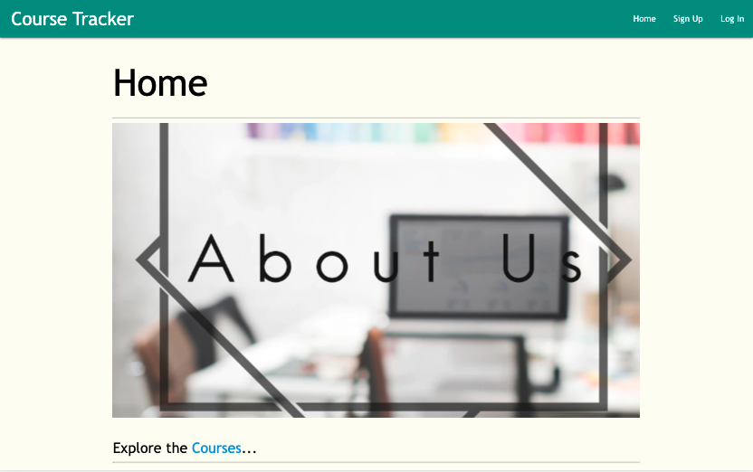
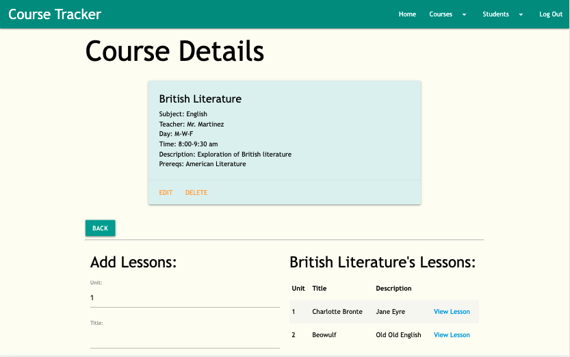
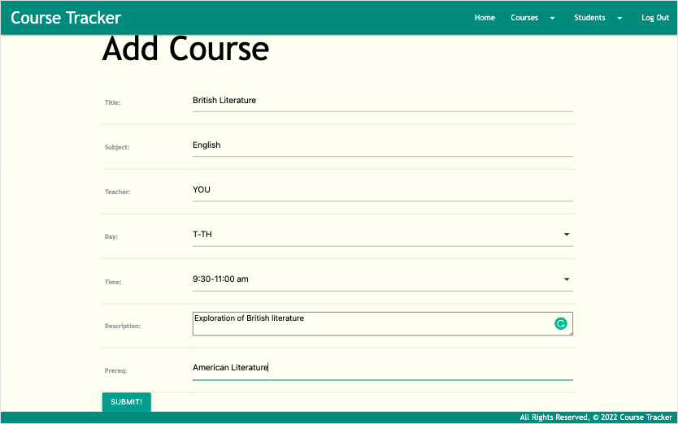
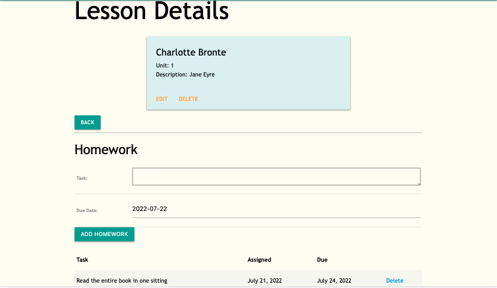
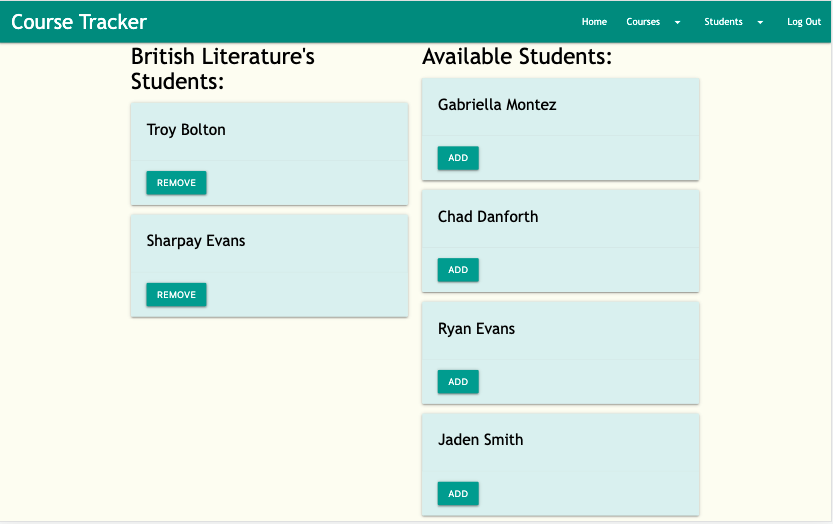
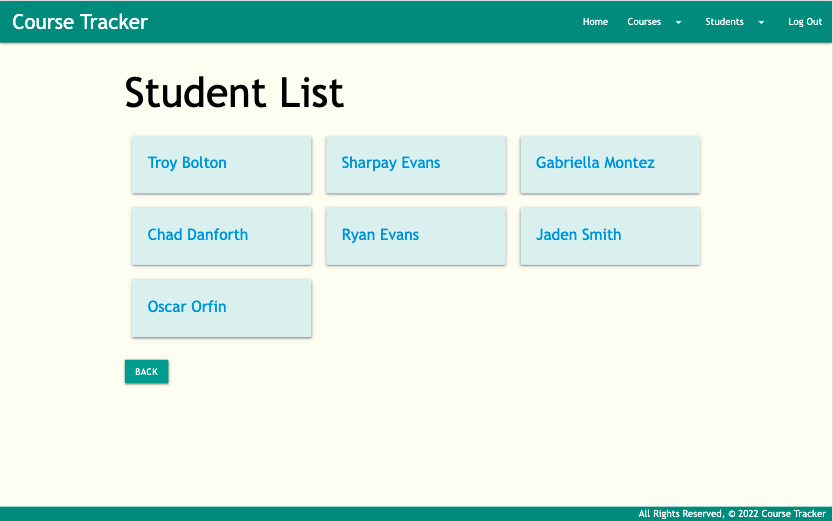
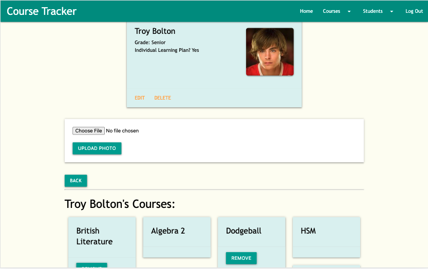
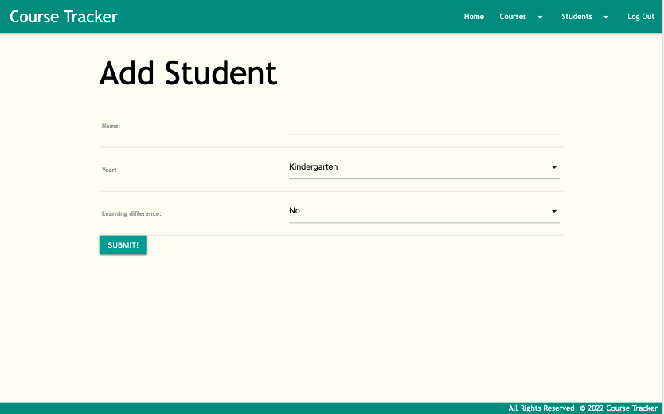
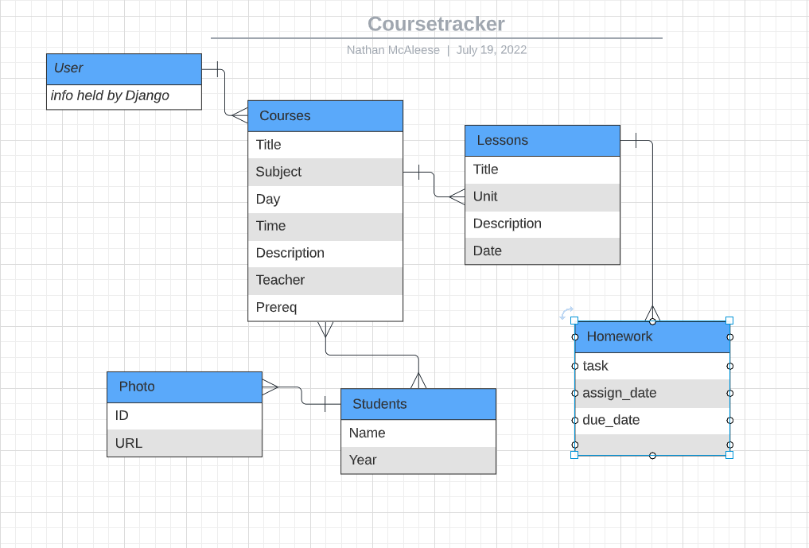
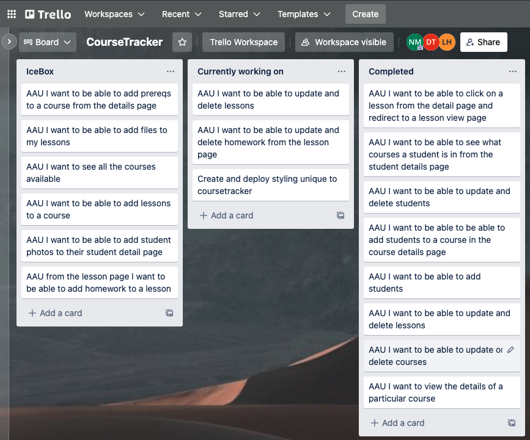

# Coursetracker

Welcome to [Coursetracker](https://coursetracker-523.herokuapp.com/)! The one stop shop for all of your teacher needs! 

Want to see all of the courses your school is offering this semester? Check out our easy to access course catalogue!

Let's create the course you'll be teaching this semester! It's as easy as can be. Just fill out the info and hit submit!

But what's a lesson plan without homework?! Simply add the assignment details, and they're appear right on the lesson.

Now we can see all the details of your new course and add lesson plans!

You can even see what students are taking your class this semester or add and remove them as you like!

Speaking of students, let's check out the school roster. Simply click on the view all students link and see who will be attending next year

Want to check in on one student in particular? Just click on the student's name and get the student's details, photo, and the courses they'll be taking!

You can even add a student you would like to attend! (Be sure to disclose any learning differences that would ensure a differentiated learning plan!)

With coursetracker we make it all easy. Just point and click!

Come visit: https://coursetracker-523.herokuapp.com/

# Technologies Used:

Python, JavaScript, CSS, Materialize, HTML, DTL, PostgreSQL, AWS,

# Where we started:

Our ERD

Trello

# Next Steps:

ICE BOX:

- creating different users for teachers, administration, or students
- adding file upload functionality for assignments and lessons
- adding Google classroom integration